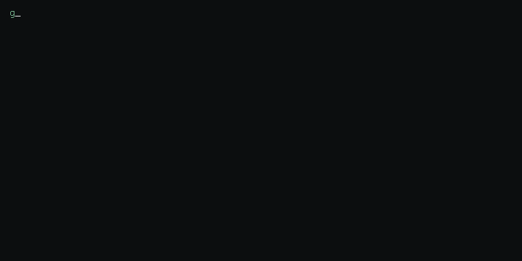

<h1 align="center">Mina Sameh</h1>
<h3 align="center">Senior Software Engineer — full-stack, web &amp; mobile</h3>

TypeScript · React / Next.js · Node.js / NestJS · React Native &amp; Expo · PostgreSQL / MongoDB

---

### Stack

---

### Featured projects

| | |
|---|---|
| **[dscan](https://github.com/gor3a/dscan)** | Interactive terminal disk scanner & cleaner for macOS and Linux |
| **[vehicle-makes-models](https://github.com/gor3a/vehicle-makes-models)** | Open dataset — 164 makes, 30k+ engine specs, auto-updated weekly (JSON/CSV/SQLite, ODbL) |
| **[fde](https://github.com/gor3a/fde)** | CLI + MCP server + Claude eval harness for a simulated enterprise product |
| **[newtab-for-linkedin](https://github.com/gor3a/newtab-for-linkedin)** | Chrome extension — open LinkedIn posts in a new tab, zero permissions |

---

